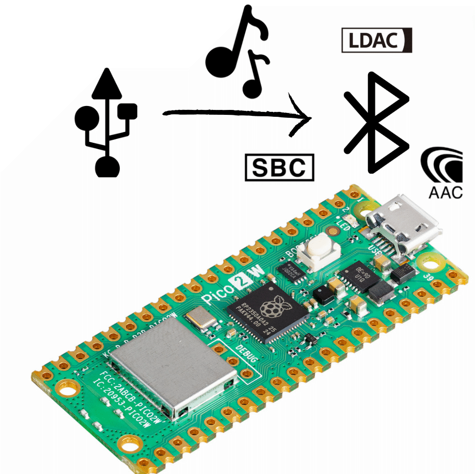

# PicoW USB Audio to Bluetooth Adapter
The Pico W USB Audio to Bluetooth Adapter transforms your Raspberry Pi Pico W into a high-quality audio streaming device.
It allows any device with a USB input, including MacOS, Windows, Linux, Nintendo Switch, PS4/PS5, and more, to gain Bluetooth Audio capability.
With Pico W Adapter, you can easily transmit audio wirelessly from your USB audio source to your Bluetooth headphones or speaker, enhancing your listening experience.


The Pro version is designed to stream audio with multiple codecs. Currently, it is under development and not very stable. If you don't need to stream the LDAC audio, you can use the regular version.  It is much more stable and easy to use.


To make sure we can keep working on free and open-source projects like this,  
**please consider becoming a [:heart: Sponsor via PayPal](https://www.paypal.com/donate/?business=UZAK3WFV233ML&no_recurring=0&item_name=Help+me+build+more+project%21&currency_code=USD) or support us via [:coffee: Ko-fi](https://ko-fi.com/wasdwasd0105).**


<p align="center">

</p>

### Driver-Free Setup
Setting up PicoW requires no driver or software installation. Simply plug the Pico W into your device's USB port, set your Bluetooth headphones or speakers to pairing mode, and an automatic connection will be made.


### Multiple Bluetooth Codecs
Pico W Bluetooth Adapter utilizes multiple codecs to deliver high-quality audio. 

#### LDAC
The input is 16-bit 44100Hz PCM audio, and it can steam LDAC audio at 303(Mobile Quality) and 606(Standard Quality) Kbps. 303 is more stable than 606 Kbps. 

#### APTX/ APTX HD
Coming soon. Aptx connection have set up. However, the Pico W is not powerful enough to use [libopenaptx](https://github.com/pali/libopenaptx) to encode real-time audio. It will use 30ms to encode a 10ms audio. I will try some alternative projects or optimize the library.

#### AAC
Will try fdk-aac, but not sure it can run

#### SBC
Ready to use


### Video demo

[](http://www.youtube.com/watch?v=Dilagi7l4xc "")


## Installation

Installing the Pico W USB Audio to Bluetooth Adapter firmware involves flashing a UF2 (USB Flashing Format) file onto your Raspberry Pi Pico. Follow these steps:

1. **Download the UF2 file:** You can find the latest firmware for the PicoW USB Audio to Bluetooth Adapter at the [releases page](https://github.com/wasdwasd0105/PicoW-usb2bt-audio/releases) of the GitHub repository. Download the `.uf2` file from the latest release.

2. **Connect the Pico to your computer:** First, ensure that your Pico is not connected to your computer. Then, hold down the 'BOOTSEL' button on the Pico while you plug it into your computer using a micro USB cable. It will appear on your computer as a mass storage device (like a USB flash drive).

3. **Copy the UF2 file:** Simply drag and drop (or copy and paste) the downloaded UF2 file onto the Pico.

4. **Reset the Pico:** Once the UF2 file has been copied onto the Pico, it will automatically reset and start running the new firmware.


## Usage

Using the PicoW USB Audio to Bluetooth Adapter is a straightforward process. Here are the steps to follow:

1. **Connect your Pico W to your audio source device:** Use a USB cable to connect your Raspberry Pi Pico W to the device that you want to stream audio from.

2. **Set the audio output on your source device:** On your audio source device, go to your sound settings and change the audio output device to `USB Bluetooth Audio`.

3. **Pairing a new device:** To pair a new device, long press the 'BOOTSEL' button on the Pico W and release it the led light will blink fast. Then, put the new Bluetooth device into pairing mode. The Pico W will automatically connect to it.

4. **Start playing audio:** Once everything is set up, you can start playing audio from your source device. The audio will be streamed to your Bluetooth device via the Pico W.

5. **Reconnecting a device:** You can connect/reconnect the headphone by short pressing the 'BOOTSEL' button when it is not streaming audio (LED light not blinking)

6. **Switch Codec:** While audio is streaming, you can short press the 'BOOTSEL' button to switch codec. You should need to press the key twice to switch the codec.
7. If you press the key for times but it has no response. It means it is crash. Please reconnect the USB. 


## Green LED light Status Indicator

1. **Blinking Slow (1s):** When the Green LED light is blinking slow, it indicates that audio is currently streaming. Different LED light on time means different streaming mode:

| LED on time | codec |
|-------------|-------|
| 0.2s        | LDAC  |
| 1s          | SBC   |

2. **Blinking Fast (0.5s):** It means that the PicoW Adapter is in pairing mode.
3. **On (Steady Light):** It means that the PicoW Adapter is on standby. Short-press the key to reconnect the last saved device.


## Compile & Debug

In order to compile the PicoW USB Audio to Bluetooth Adapter firmware from source code, you need to follow these steps:

1. **Prepare your environment:** Make sure that you have a working development environment for Raspberry Pi Pico projects. This includes having the required compiler and tools installed. You may refer to the [Getting started with Raspberry Pi Pico](https://www.raspberrypi.org/documentation/rp2040/getting-started/) guide for detailed instructions.

2. **Set environment variables:** Before you can build the project, you need to set two environment variables: `PICO_SDK_PATH` and `PICO_EXTRAS_PATH`. For example:

```bash
export PICO_SDK_PATH=~/pico-sdk
export PICO_EXTRAS_PATH=~/pico-extras
```

3. **Build the project:** After setting up your environment, navigate to the project directory in a terminal and run the provided build script:

```bash
./build.sh
```

This script should compile the project and produce a UF2 firmware file that you can flash onto your Pico W.

4. **Debug Serial input/output:** You can use uart to see the debug info. Connect the GPIO 0 and 1 as TX and RX. To enable BTstack's serial input, you can uncomment `HAVE_BTSTACK_STDIN` under btstack_config.h


## Acknowledgments

This project wouldn't have been possible without the foundational work provided by the following projects:

1. [usb-sound-card](https://github.com/raspberrypi/pico-playground/tree/master/apps/usb_sound_card): It served as a valuable reference for handling USB audio data with the Raspberry Pi Pico.

2. [a2dp_source_demo](https://github.com/bluekitchen/btstack/blob/master/example/a2dp_source_demo.c): The Advanced Audio Distribution Profile (A2DP) source demo provided by the BTstack.

3. [avdtp_source_test.c](https://github.com/bluekitchen/btstack/tree/v1.5.4/test/pts)


## License

This project is licensed under the terms of the Apache License 2.0.


## Copyright

### libldac: https://android.googlesource.com/platform/external/libldac
```
 Copyright (C) 2013 - 2016 Sony Corporation
 
  Licensed under the Apache License, Version 2.0 (the "License");
  you may not use this file except in compliance with the License.
  You may obtain a copy of the License at
 
       http://www.apache.org/licenses/LICENSE-2.0
 
  Unless required by applicable law or agreed to in writing, software
  distributed under the License is distributed on an "AS IS" BASIS,
  WITHOUT WARRANTIES OR CONDITIONS OF ANY KIND, either express or implied.
  See the License for the specific language governing permissions and
  limitations under the License.
```

NOTICE
```
---------------
 Certification
---------------
   Taking the certification process is required to use LDAC in your products.
   For the detail of certification process, see the following URL:
      https://www.sony.net/Products/LDAC/aosp/

```

### ldacBT: https://github.com/EHfive/ldacBT
```
 Copyright 2018-2019 Huang-Huang Bao

  Licensed under the Apache License, Version 2.0 (the "License");
  you may not use this file except in compliance with the License.
  You may obtain a copy of the License at

       http://www.apache.org/licenses/LICENSE-2.0

  Unless required by applicable law or agreed to in writing, software
  distributed under the License is distributed on an "AS IS" BASIS,
  WITHOUT WARRANTIES OR CONDITIONS OF ANY KIND, either express or implied.
  See the License for the specific language governing permissions and
  limitations under the License.
```

